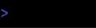
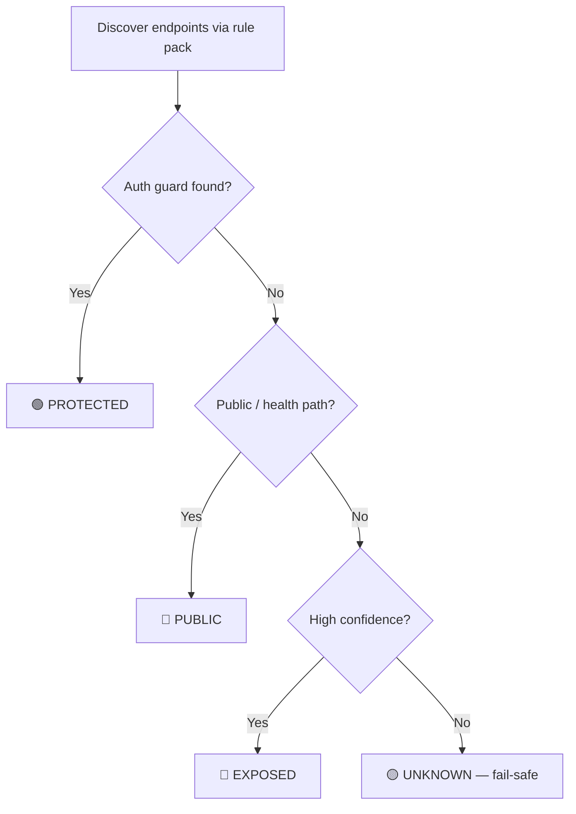

# Endpoint & Auth Mapper


A universal, offline, dependency-free static analyzer that maps HTTP endpoints
across languages and classifies each one's **authentication posture** as
`PROTECTED`, `EXPOSED`, `UNKNOWN`, or `PUBLIC`.

It answers one question fast, in any codebase you own:

> *Which of my HTTP endpoints have no authentication guard?*

<p align="center">
  
</p>

---

## Table of contents

- [Why it exists](#why-it-exists)
- [Design guarantees](#design-guarantees)
- [Supported stacks](#supported-stacks-bundled-rule-packs)
- [Install](#install)
- [Quick start](#quick-start)
- [The three layers](#the-three-layers)
- [Exit codes (CI contract)](#exit-codes-ci-contract)
- [How classification works](#how-classification-works)
- [Documentation](#documentation)
- [Scope of use](#scope-of-use)
- [License](#license)

---

## Why it exists

Unauthenticated endpoints are one of the most common and highest-impact
web vulnerabilities (OWASP API Security **API2: Broken Authentication**,
**API5: Broken Function Level Authorization**). They are easy to introduce and
hard to spot in review. This tool gives developers a fast, repeatable,
CI-friendly way to catch them **before deployment**.

## Design guarantees

<details>
<summary>Click to expand</summary>

| Guarantee | How it is enforced |
|---|---|
| **Source-gated** | Analyzes source you already possess. No network, no URLs, no live probing. |
| **Fail-safe** | Ambiguity resolves to `UNKNOWN`, never `PROTECTED`. |
| **Read-only** | Target code is parsed as text, never imported or executed. |
| **Zero-dependency** | Python standard library only at runtime. |
| **Confidential output** | Reports are written to a gitignored directory; secrets are redacted. |
| **Deterministic** | Sorted, stable output suitable for CI diffing and baselines. |
| **Universal** | Language knowledge lives in JSON rule packs; the engine is language-agnostic. |

See [`SECURITY.md`](./SECURITY.md) for the full dual-use statement and threat model.

</details>

## Supported stacks (bundled rule packs)

<details>
<summary>PHP, Node, Python, Java, Go, Ruby, C# — click to expand</summary>

- **PHP** — native/session
- **Node/Express**
- **Python** — Flask, Django (+DRF)
- **Java/Kotlin** — Spring
- **Go** — net/http, chi, gin, mux
- **Ruby** — Rails, Sinatra
- **C#** — ASP.NET Core

Adding a stack is a JSON file — see
[Rule pack schema](./docs/reference/rulepack-schema.md).

</details>

---

## Install

Requires Python 3.10+. No third-party packages.

```bash
# From a checkout:
pip install ./endpoint-auth-mapper

# Or run without installing:
python -m authmapper --project /path/to/your/code
```

## Quick start

```bash
# Human-readable table
authmap --project . 

# Machine-readable JSON, written to the confidential report dir
authmap --project . --format json --output authmap

# SARIF for GitHub code scanning
authmap --project . --format sarif --output authmap

# Interactive terminal UI (Layer 2)
authmap --project . --interactive

# CI gate: exit non-zero on new high-confidence exposed endpoints
authmap --project . --fail-on EXPOSED --min-confidence high \
        --baseline .authmap-baseline.json --quiet
```

## The three layers

1. **Batch CLI** — one run, one report, clean exit codes. The core.
2. **Interactive terminal UI** — a stdlib-only ANSI rich TUI to browse,
   filter, search, and export results (`--interactive`). Falls back to the
   table report on terminals without ANSI support.
3. **CI gate** — pre-commit hook and GitHub/GitLab templates in [`ci/`](./ci)
   that block shipping unauthenticated endpoints. This is the intended
   "service" placement — an on-demand gate, never a running daemon.

## Exit codes (CI contract)

<details>
<summary>Click to expand</summary>

| Code | Meaning |
|---|---|
| `0` | No findings at or above `--fail-on` |
| `1` | Gating findings present |
| `2` | Tool/setup error |

</details>

## How classification works



Full details in the [Architecture explanation](./docs/explanation/architecture.md).

## Documentation

The project documentation is organized using the [Diátaxis framework](https://diataxis.fr/). Start at the [Docs overview](./docs/README.md).

- [**Tutorials**](./docs/tutorials/) — Guided step-by-step introductions (e.g. Getting started).
- [**How-to guides**](./docs/how-to/) — Task-oriented instructions (e.g. Gating CI, suppressing findings).
- [**Reference**](./docs/reference/) — Technical descriptions (e.g. CLI flags, rule pack schema).
- [**Explanation**](./docs/explanation/) — Background context (e.g. Architecture, classification model).

Other important documents:
- [`SECURITY.md`](./SECURITY.md) — dual-use statement, threat model, mitigations
- [`CONTRIBUTING.md`](./CONTRIBUTING.md) — dev setup, tests, style

## Scope of use

Run this tool only on code you **own or are explicitly authorized to audit**.
It performs no network activity and cannot interact with running systems.

## License

MIT — see [`LICENSE`](./LICENSE).
